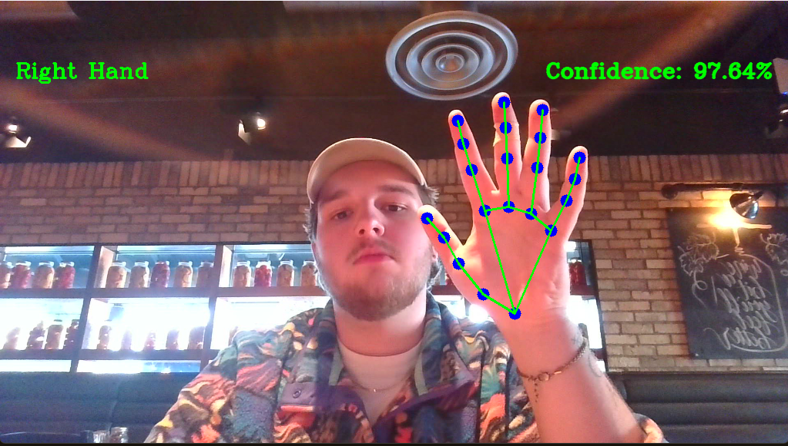

# Hand Detection

Detect a left or right hand on video and display the hand land marks on the hands.
The hand landmarks model is shown on the image below.

An example of the hand landmarks model being displayed on a hand is shown below

## Setup

Run the following

`pip install mediapipe`

`pip install opencv-python`

## Run the program

Run

`python handdetect.py`

Close

press Q
